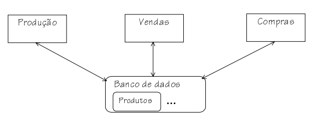
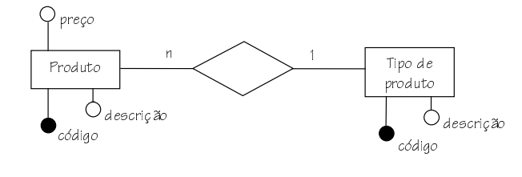
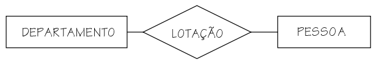

<script src = "https://polyfill.io/v3/polyfill.min.js?features=es6"></script>
<script id = "MathJax-script" async src = "https://cdn.jsdelivr.net/npm/mathjax@3/es5/tex-mml-chtml.js"></script>

<h1>Projeto de banco de dados</h1>

<p align = "justify">
Segundo Date [1] um Sistema de Banco de Dados (SGBD) é basicamente apenas um sistema computadorizado de criação e manutenção de registros que estão em certo grau relacionados. O Banco de Dados (BD), por si só, pode ser considerado como o equivalente eletrônico de um armário de arquivamento; ou seja, ele é um repositório ou recipiente para uma coleção de arquivos de dados computadorizados (Dados e Meta-Dados). Os usuários de um sistema podem realizar (ou melhor, solicitar que o sistema realize) diversas operações envolvendo tais arquivos.

Heuser [2] afirma que o banco de dados é uma das maneiras mais eficazes de controlar a redundância de dados visto que o mesmo permite o compartilhamento de dados entre usuários/programas. A Figura 01 apresenta um esquema abstrato de um banco de dados de produtos e o possível uso dessa informação:

<center></center>
<b>Figura 01.</b> Exemplo de um modelo abstrato de banco de dados.
<br><br>

Elmarsi e Navathe [3] afirmam que uma banco de dados possui algumas questões relevantes como por exemplo:
<ul>
    <li>Natureza autodescritiva dos dados;</li>
    <li>Isolamento entre dados e programa;</li>
    <li>Suporte para múltiplas visualizações dos dados;</li>
    <li>Compartilhamento e acesso simultâneo aos dados.</li>
</ul>

Elmarsi e Navathe [3] afirmam que há situações em que não é necessário o uso de um banco de dados, são elas:
<ul>
    <li>Investimentos iniciais altos em hardware, software e treinamento. ;</li>
    <li>O banco de dados e suas aplicações são simples, bem definidas e sem previsão de mudanças;</li>
    <li> acesso de múltiplos usuários aos dados não é necessário.</li>
</ul>

Para construir um banco de dados é necessário avaliar níveis de abastração dos dados para projetar um banco de dados. Esses níveis de abastração permitirão que possamos estruturas estes dados e que eles possam ser salvos de maniera integra. São modelos:

<dl>
    <dt>Modelo conceitual</dt>
        <dd>Registra quais dados podem aparecer no BD porém não registra como estes dados estão armazenados a nível de SGBD. A forma mais difundida deste tipo de modelagem é o sistema Entidade - Relacionamento (ER).</dd>
    <dt>Modelo lógico</dt>
        <dd>Um modelo lógico é uma descrição de um banco de dados no nível de abstração visto pelo usuário do SGBD. Assim, o modelo lógico é dependente do tipo particular de SGBD que está sendo usado. Por exemplo em um SGBD relacional esse formato é o de tabelas.</dd>
</dl>


<h2>O modelo Entidade-Relacionamento</h2>
<p align = "justify">
A abordagem <b>ER</b> foi criada por Peter Chen em 1976. A Figura 02 apresenta um modelo de Entidade - Relacionamento (ER).

<center></center>
<b>Figura 02.</b> Diagrama Entidade-Relacionamento.
<br><br>

O conceito ER é formado por:
<dl>
    <dt>Entidade</dt>
        <dd><p align = "justify">Como dito anteriormente a entidade é o objeto o qual deseja-se representar, normalmente a entidade dará origem a uma tabela no banco de dados. A entidade é representada por um retângulo no modelo conceitual. Um exemplo de entidade seria o <b>carro</b>.</p></dd>
    <dt>Relacionamento</dt>
        <dd><p align = "justify">Além da descrição dos objetos que formam o banco de dados é necessário estabelecer a regra de associação entre estes objetos e para isso dá-se o nome de relacionamento. A regra de associação é representada por meio de um losango conforme modelo da Figura 03.</p></dd>
</dl>

Os 
    <dt>Atributos</dt>
        <dd><p align = "justify">Estes são denominados como as propriedades que descrevem uma entidade. Por exemplo atributos de um objeto <b>carro</b> poderiam ser: (a) Nº de chassi; (b) Cor, (c) Motor e quaisquer outros elementos que auxiliem ou sejam necessários na descrição de um carro para um determinado modelo de negócio. Os atributos podem ser representados por meio de cículo ou elipses no modelo conceitual. Os atributos tem algumas propriedades que vou discutir mais a frente.</p></dd>

<center></center>
<b>Figura 02.</b> Diagrama Entidade-Relacionamento.
<br><br>

</p>
<p align = "justify">Veja que o programa Java utiliza-se das chaves <code>{ }</code> para denominar o trecho de início e fim de um algoritmo. Porsdstanto para aplicar a impressão do termo <b>Olá Mundo!!!</b> vamos empregar o método <code>System.out.println</code>. Vejamos como fica a versão final do algoritmo (<code>arq1.java</code>):</p>

```java
public class Arq1 {
	public static void main(String[] args){
		System.out.println("Olá Mundo!!");
	}
}
```
```
Output
Olá Mundo!!
```

<p align = "justify">Além disso é válido salientar que após o uso de métodos, funções e outros é necessário "encerrar a linha de código" com <code>;</code>. <br><br>
Agora vamos empregar dados matemáticos para construção de um algoritmo Java. Para isso vamos construir um algoritmo que determina a Area de uma circunferência de diâmetro "D". Além do método de impressão vamos importar a biblioteca que nos permitirá recolher o dado digitado por um teclado. Para isso vamos importar da seguinte forma:</p> 

```java
import java.util.Scanner;
```

<p align = "justify">Ainda sem entrar na Orientação à Objetos vamos criar um objeto que que quando invocado permitirá a execução de métodos referentes a leitura do dado digitado via teclado. Vejamos o exemplo (<code>arq2.java</code>):</p> 

```java
import java.util.Scanner;

public class Arq2 {
    public static void main(String[] args){
        // Criação do objeto
        System.out.println("Entre com o diâmetro: ");
        Scanner input = new Scanner(System.in);
        // Leitura do Diâmetro
        double diametro = input.nextDouble();
        // Determinação da área
        double area = 3.14159 * diametro * diametro / 4;
        // Impressão do valor
        System.out.println("O valor da área da circunferência de diâmetro " + diametro + " é " + area);
    }
}
```
```
Output
Entre com o diametro: 
20
O valor da area da circunferencia de diametro 20.0 e 314.159
```

<h2>Instalando o Java e rodando o primeiro programa</h2>

<p align = "justify">Para desenvolver aplicações no java vamos buscar no <a href="www.google.com.br" target="_blank">Google</a> pela palavra-chave "java download jdk". <br><br>
Após a instalação do <b>java</b> o primeiro programa poderá ser compilado utilizando o <code>cmd</code>. Utilizando o comando <code>cd..</code> para acessar a pasta do arquivo. Com o caminho atualizado no terminal MS-DOS execute o seguintes comandos:</p> 

```sh
javac arq1.java 
```

<p align = "justify">O nome do arquivo deverá ser o mesmo da classe adotada. No caso o nomes dos arquivos desse repositório estão com o padrão <code>arqNUMERAL</code>. Onde <> indica o numeral a ser digitado.<br><br>
Se aplicarmos um comando <code>dir</code> será possível ver que um novo arquivo <code>.class</code> foi gerado na pasta. Esse arquivo é necessário para que a máquina virtural (formato bytecode) entenda o código java.<br><br>
Portanto para executar o código digite no terminal:</p> 

```sh
java arq1 
```

<p align = "justify">Daqui em diante vamos utilizar uma IDE para o desenvolvimento em java. Neste caso vamos utilizar a IDE <a href="https://www.eclipse.org/downloads/packages/release/kepler/sr1/eclipse-ide-java-developers" target="_blank">Eclipse</a>. Quando efetuar a instalação pode utilizar o pacote <b><i>Eclipse IDE for Java Developers</i></b>.<br><br>
Para criar um novo projeto java no Eclipse basta clicar em:</p>

```sh
├── File
    └── New (Alt+Shift+N)
        └── Java Project
```

<p align = "justify">Aqui criaremos um projeto chamado <code>sintaxe-basica</code> e dentro da pasta <code>src</code> colocaremos os arquivos de extensão <code>.class</code>. Vamos então escrever o algoritmo arq1 dentro da plataforme Eclipse.</p>

```sh
├── src (clica com botão direito)
    └── New
        └── Class (Escrever arq1)
```

<p align = "justify">Com o arquivo <code>arq1.java</code> criado utilize o comando:</p>

```sh
├── Botão Direito
    └── Run As
        └── Java Application
```

<h2>Sintaxe básica</h2>

<p align = "justify">O Java é uma linguagem estática e fortemente tipada. Logo será necessário informar no começo do código o tipo da variável. Tal exemplo disso foi feito no algoritmo <code>arq2</code>.<br><br>
A Tabela 1 apresenta os tipos de variáveis numéricas:</p>

<table widht = "100%">
<thead>
  <tr>
    <th>Nome</th>
    <th>Intervalo</th>
    <th>Memória</th>
  </tr>
</thead>
<tbody>
  <tr>
    <td>byte</td>
    <td>\(-2^7\) a \(2^7-1\)</td>
    <td>8-bit</td>
  </tr>
  <tr>
    <td>short</td>
    <td>\(-2^{15}\) a \(2^{15}-1\)</td>
    <td>16-bit</td>
  </tr>
  <tr>
    <td>int</td>
    <td>\(-2^{31}\) a \(2^{31}-1\)</td>
    <td>32-bit</td>
  </tr>
  <tr>
    <td>long</td>
    <td>\(-2^{63}\) a \(2^{63}-1\)</td>
    <td>64-bit</td>
  </tr>
  <tr>
    <td>float</td>
    <td>\(-3.4028235^{38}\) a \(-1.4^{-45}\) e \(1.4^{-45}\) a \(3.4028235^{38}\)</td>
    <td>32-bit IEEE 754</td>
  </tr>
  <tr>
    <td>double</td>
    <td>\(-1.79769^{308}\) a \(-4.9^{-324}\) e \(4.9^{-324}\) a \(1.79769^{308}\)</td>
    <td>64-bit IEEE 754</td>
  </tr>
</tbody>
</table>

<p align = "justify">Agora vamos construir um algoritmo com as operações matemáticas básicas:</p>

```java
public class Arq3 {
    public static void main(String[] args){
        // Declaração das variáveis
        int valor1 = 10, valor2 = 40, soma,  diferenca, produto;
        float divisao1, divisao2, modulo, cast;
        // Cálculo
        soma = valor1 + valor2;
        diferenca =  valor1 - valor2;
        produto = valor1 * valor2;
        divisao1 = (float) valor1 / valor2;
        divisao2 = valor1 / valor2;
        modulo = valor1 % valor2;
        cast = divisao1 + 1;
        // Impressão
        System.out.printf("Soma:                        %d \n", soma);
        System.out.printf("Subtração:                   %d \n", diferenca);
        System.out.printf("Produto:                     %d \n", produto);
        System.out.printf("divisao c/ cast:             %.2f \n", divisao1);
        System.out.printf("divisao s/ cast:             %.2f \n", divisao2);
        System.out.printf("Resto:                       %.2f \n", modulo);
        System.out.printf("Funcionamento cast:          %.2f \n", cast);
    }
}
```
```
Outup:
Soma:                        50 
Subtracao:                   -30 
Produto:                     400 
divisao c/ cast:             0,25 
divisao s/ cast:             0,00 
Resto:                       10,00 
Funcionamento cast:          1,25 
```

<blockquote>
<p align = "justify">Perceba que empregamos a método <code>System.out.printf</code> que permitirá a impressão de valores em ponto flutuante. No caso de usar o método <code>System.out.println</code> não seria possível a impressão das casas decimais.</p>
</blockquote>

<blockquote>
<p align = "justify">Outra observação interessante é em relação a conversão de tipo de variável empregado na variável <code>divisao</code>. Apesar da atribuição de <code>divisao</code> como <b>float</b> não será impresso o valor correto (erro de truncamento). Para isso empregamos o conceito de <b>casting</b> para converter uma divisão de inteiros para um resultado em <b>float</b>. Além disso é válido salientar que o sentido de execução da linguagem é da direita para esquerda, primeiro será feita a divisão e depois a atribuição.</p>
</blockquote>


<p align = "justify">Para trabalhar com letras utilizaremos as variáveis tipo <b>char</b> ou <b>String</b>. Porém no dia a dia de programação será empregado o tipo <b>String</b>. Abaixo vemos um exemplo de uso do tipo <b>String</b>.</p>

```java
public class Arq4 {
    public static void main(String[] args){
        // Declaração das variáveis
        String parcela1 = "22";
        String parcela2 = "13";
        // Impressão
        System.out.println(parcela1 + parcela2);
    }
}
```
```
Outup:
2213
```

<h2>Controle de fluxo</h2>

<h3>Decisão</h3>

<p align = "justify">Primeiro veremos a sintaxe do controle de decisão <b>if</b>.</p>

```java
import java.util.Scanner;

public class Arq5 {
    public static void main(String[] args){
        System.out.println("Entre com a idade: ");
        Scanner input = new Scanner(System.in);
        int idade = input.nextInt();
        if (idade > 18) {
            System.out.println("O valor registrado e maior que 18 anos");
        } else {
            System.out.println("O valor registrado e menor que 18 anos");
        }
    }
}
```
```
Outup:
Entre com a idade: 
20
O valor registrado e maior que 18 anos
```

<p align = "justify">Outro exemplo mais complexo utilizando a estrutura <b>else if</b>.</p>

```java
import java.util.Scanner;

public class Arq6 {
    public static void main(String[] args){
        System.out.println("Entre com a idade do jogador de futebol: ");
        Scanner input = new Scanner(System.in);
        int idade = input.nextInt();
        if (idade < 13) {
            System.out.println("O jogador não pode ser inscrito neste torneio");
        } else if (idade > 14 &&  idade <= 15) {
            System.out.println("Jogador inscrito na categoria Sub-15");
        } else if (idade > 15 &&  idade <= 17) {
            System.out.println("Jogador inscrito na categoria Sub-17");  
        } else if (idade > 17 &&  idade <= 20) {
            System.out.println("Jogador inscrito na categoria Sub-20");
        } else if (idade > 20) {
            System.out.println("Jogador inscrito na categoria adulto");
        }   
    }
}
```
```
Outup:
Entre com a idade do jogador de futebol: 
22
Jogador inscrito na categoria adulto
```

<p align = "justify">Utilize o <code>switch</code> quando tiver uma grande quantidade de possibilidades.</p>

```java
public class Arq7 {
    public static void main(String[] args) {
        int mes = 10;
        switch (mes) {
            case 1:
                System.out.println("O mês é Janeiro");
                break;
            case 2:
                System.out.println("O mês é Fevereiro");
                break;
            case 3:
                System.out.println("O mês é Março");
                break;
            case 4:
                System.out.println("O mês é Abril");
                break;
            case 5:
                System.out.println("O mês é Maio");
                break;
            case 6:
                System.out.println("O mês é Junho");
                break;
            case 7:
                System.out.println("O mês é Julho");
                break;
            case 8:
                System.out.println("O mês é Agosto");
                break;
            case 9:
                System.out.println("O mês é Setembro");
                break;
            case 10:
                System.out.println("O mês é Outubro");
                break;
            case 11:
                System.out.println("O mês é Novembro");
                break;
            case 12:
                System.out.println("O mês é Dezembro");
                break;
            default:
                System.out.println("Mês inválido");
                break;
        }
    }
}
```
```
Outup:
O mês é Outubro
```

<h3>Laço</h3>

<p align = "justify">Agora veremos o controle de fluxo por laço. Primeiro vamos ver o laço <code>while</code>. Vejamos o exemplo:</p>

```java
public class Arq8 {
	public static void main(String args[]) {
		int contador = 0;
		while (contador < 10) {
			System.out.println("Repetição nr: " + contador);
			contador += 1;
			// Outra possibilidade
			// contador++
		}
	}
}
```
```
Outup:
Repetição nr: 0
Repetição nr: 1
Repetição nr: 2
Repetição nr: 3
Repetição nr: 4
Repetição nr: 5
Repetição nr: 6
Repetição nr: 7
Repetição nr: 8
Repetição nr: 9
```
<blockquote>
<p align = "justify">Veja que a repetição parou em 9 visto que a marcação de para foi estabelecida em <code>< 10</code>. Também é válido salientar os formatos de soma com operadores ariméticos incrementais como o exemplo <code>contador++</code>.</p>
</blockquote>

<p align = "justify">Agora veremos o controle de fluxo por um laço <code>for</code>. Vamos ver exemplo de uma contagem crescente e decrescente:</p>

```java
public class Arq9 {
	public static void main(String args[]) {
		// Contagem crescente
        System.out.println("Teste de contagem crescente");
        for (int i = 0; i < 10; i++) {
			System.out.println("Contagem crescente: " + i);
		}
        System.out.println();
        
        // Contagem decrescente
		System.out.println("Teste de contagem decrescente");
        for (int i = 9; i > -1; i--) {
			System.out.println("Contagem decrescente: " + i);
		}
	}
}
```
```
Outup:
Teste de contagem crescente
Contagem crescente: 0
Contagem crescente: 1
Contagem crescente: 2
Contagem crescente: 3
Contagem crescente: 4
Contagem crescente: 5
Contagem crescente: 6
Contagem crescente: 7
Contagem crescente: 8
Contagem crescente: 9

Teste de contagem decrescente
Contagem decrescente: 9
Contagem decrescente: 8
Contagem decrescente: 7
Contagem decrescente: 6
Contagem decrescente: 5
Contagem decrescente: 4
Contagem decrescente: 3
Contagem decrescente: 2
Contagem decrescente: 1
Contagem decrescente: 0
```

<p align = "justify">Podemos empregar o comando <code>break</code> dentro de um laço <code>for</code> definindo assim uma parada. Vejamos o exemplo:</p>

```java
public class Arq10 {
	public static void main(String args[]) {
		// Contagem crescente
        System.out.println("Teste de contagem crescente");
        for (int i = 0; i < 10; i++) {
			System.out.println("Contagem crescente: " + i);
            if (i == 5) {
                break;
            }
		}
        System.out.println();
        
        // Contagem decrescente
		System.out.println("Teste de contagem decrescente");
        for (int i = 9; i > -1; i--) {
			System.out.println("Contagem decrescente: " + i);
		}
	}
}
```
```
Outup:
Teste de contagem crescente
Contagem crescente: 0
Contagem crescente: 1
Contagem crescente: 2
Contagem crescente: 3
Contagem crescente: 4
Contagem crescente: 5

Teste de contagem decrescente
Contagem decrescente: 9
Contagem decrescente: 8
Contagem decrescente: 7
Contagem decrescente: 6
Contagem decrescente: 5
Contagem decrescente: 4
Contagem decrescente: 3
Contagem decrescente: 2
Contagem decrescente: 1
Contagem decrescente: 0
```

<blockquote>
<p align = "justify">Veja que o contador ao atingir o valor <code>i=5</code> efetua o comando <code>break</code> saindo assim do primeiro laço de repetição.</p>
</blockquote>

<h2>Referências</h2>
<p align = "left" id = "1">[1]	Wikipédia. James Gosling. Wikipédia 2022. https://pt.wikipedia.org/wiki/James_Gosling.</p>


